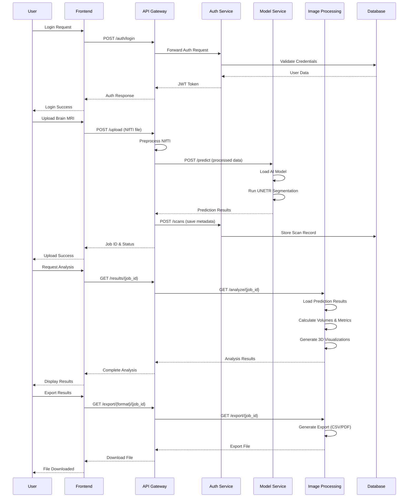
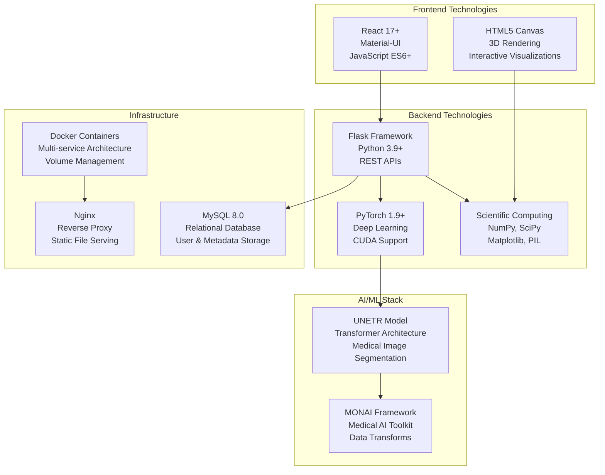

# MET-Project Architecture Diagram

```mermaid
graph TB
    %% Client Layer
    subgraph "Client Layer"
        USER[👤 User/Clinician]
        BROWSER[🌐 Web Browser<br/>React Frontend<br/>Port: 3000]
    end

    %% Load Balancer/Gateway Layer
    subgraph "Gateway Layer"
        NGINX[🔀 Nginx Reverse Proxy<br/>Port: 80]
        API_GW[🚪 API Gateway<br/>Flask Service<br/>Port: 8000]
    end

    %% Microservices Layer
    subgraph "Backend Microservices"
        subgraph "Authentication & User Management"
            USER_SVC[👥 User Service<br/>Flask + SQLAlchemy<br/>JWT Authentication<br/>User Management]
        end
        
        subgraph "AI/ML Processing"
            MODEL_SVC[🧠 Model Service<br/>PyTorch + UNETR<br/>Brain MRI Segmentation<br/>GPU Accelerated]
            IMG_PROC[📊 Image Processing Service<br/>Scientific Computing<br/>3D Visualization<br/>Analysis & Metrics]
        end
    end

    %% Database Layer
    subgraph "Database Layer"
        MYSQL[(🗄️ MySQL Database<br/>User Data<br/>Scan Metadata<br/>Patient Records<br/>Port: 13306)]
    end

    %% Storage Layer
    subgraph "Storage Layer"
        UPLOADS[📁 Shared Uploads<br/>Docker Volume<br/>NIfTI Files]
        RESULTS[📈 Shared Results<br/>Docker Volume<br/>Predictions & Analysis]
        MODELS[🤖 AI Models<br/>Local Volume<br/>UNETR Weights]
    end

    %% External Services
    subgraph "External"
        DICOM[🏥 DICOM Systems<br/>(Future Integration)]
    end

    %% User Flow Connections
    USER --> BROWSER
    BROWSER -->|HTTP/HTTPS| NGINX
    NGINX --> API_GW

    %% API Gateway Routes
    API_GW -->|/auth/*| USER_SVC
    API_GW -->|/upload, /models/*| MODEL_SVC
    API_GW -->|/analyze/*, /visualization/*| IMG_PROC
    API_GW -->|/user/*, /scans/*| USER_SVC

    %% Service Dependencies
    USER_SVC --> MYSQL
    MODEL_SVC --> UPLOADS
    MODEL_SVC --> RESULTS
    MODEL_SVC --> MODELS
    IMG_PROC --> RESULTS

    %% External Connections
    DICOM -.->|Future| API_GW

    %% Docker Network
    subgraph "Docker Network: met-network"
        API_GW
        USER_SVC
        MODEL_SVC
        IMG_PROC
        MYSQL
    end

    %% Styling
    classDef frontend fill:#e1f5fe,stroke:#01579b,stroke-width:2px
    classDef gateway fill:#f3e5f5,stroke:#4a148c,stroke-width:2px
    classDef microservice fill:#e8f5e8,stroke:#1b5e20,stroke-width:2px
    classDef database fill:#fff3e0,stroke:#e65100,stroke-width:2px
    classDef storage fill:#f1f8e9,stroke:#33691e,stroke-width:2px
    classDef external fill:#fce4ec,stroke:#880e4f,stroke-width:2px

    class BROWSER,USER frontend
    class NGINX,API_GW gateway
    class USER_SVC,MODEL_SVC,IMG_PROC microservice
    class MYSQL database
    class UPLOADS,RESULTS,MODELS storage
    class DICOM external
```

## Detailed Service Communication Flow



## Data Flow Architecture

```mermaid
flowchart LR
    subgraph "Input Data"
        NIFTI[NIfTI Files<br/>T1CE MRI Scans]
        DICOM_F[DICOM<br/>(Future)]
    end

    subgraph "Data Processing Pipeline"
        PREPROC[Preprocessing<br/>- Normalization<br/>- Resampling<br/>- Format Conversion]
        AI_MODEL[AI Model<br/>UNETR Architecture<br/>- Metastasis Detection<br/>- Tissue Segmentation]
        POST_PROC[Post Processing<br/>- Connected Components<br/>- Volume Calculation<br/>- Quality Metrics]
    end

    subgraph "Analysis & Visualization"
        ANALYSIS[Statistical Analysis<br/>- Volume Measurements<br/>- Confidence Scores<br/>- Quality Metrics]
        VIZ_2D[2D Visualizations<br/>- Slice Views<br/>- Multi-plane<br/>- Overlays]
        VIZ_3D[3D Visualizations<br/>- Volumetric Rendering<br/>- Interactive Views<br/>- Tissue Layers]
    end

    subgraph "Output & Storage"
        WEB_UI[Web Interface<br/>Interactive Viewer]
        REPORTS[Reports<br/>CSV, PDF Export]
        DATABASE[(Database Storage<br/>Metadata & History)]
    end

    NIFTI --> PREPROC
    DICOM_F -.-> PREPROC
    PREPROC --> AI_MODEL
    AI_MODEL --> POST_PROC
    POST_PROC --> ANALYSIS
    POST_PROC --> VIZ_2D
    POST_PROC --> VIZ_3D
    ANALYSIS --> WEB_UI
    VIZ_2D --> WEB_UI
    VIZ_3D --> WEB_UI
    ANALYSIS --> REPORTS
    WEB_UI --> DATABASE
    REPORTS --> DATABASE
```

## Technology Stack Overview



## Key Features & Capabilities

### 🎯 Core Functionality
- **AI-Powered Brain Metastasis Detection**: UNETR transformer model for precise segmentation
- **Multi-tissue Classification**: Metastasis, edema, and tumor core identification
- **3D Visualization**: Interactive volumetric rendering with anatomical accuracy
- **Quantitative Analysis**: Volume measurements, statistical metrics, confidence scoring

### 🔒 Security & Authentication
- **JWT-based Authentication**: Secure token-based user sessions
- **Role-based Access Control**: User management and permissions
- **CORS Protection**: Secure cross-origin resource sharing

### 📊 Data Management
- **NIfTI Support**: Medical imaging standard compatibility
- **Metadata Tracking**: Complete scan history and patient information
- **Export Capabilities**: CSV and PDF report generation
- **Data Persistence**: MySQL database for long-term storage

### 🚀 Performance & Scalability
- **Microservices Architecture**: Independent, scalable service components
- **GPU Acceleration**: CUDA-enabled AI model inference
- **Caching Strategy**: Volume and visualization caching for performance
- **Resource Management**: Docker-based containerization with resource limits

### 🔧 Developer Experience
- **Hot Reloading**: Development environment with live updates
- **API Documentation**: RESTful API with clear endpoint specifications
- **Error Handling**: Comprehensive logging and error management
- **Testing Support**: Unit testing framework integration

This architecture provides a robust, scalable, and maintainable solution for brain metastasis analysis with clear separation of concerns and modern best practices.
